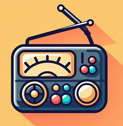

# MPD Radio
Listen to internet radios using your MPD servers

For inspiration, you can look at my [instructions for running an MPD server on a Raspberry Pi](https://gist.github.com/r0b0/8606332f68ed4af5f9b3ff37724c605f).

## Download
Please see the [Releases page](https://github.com/r0b0/mpd-radio/releases/) for Linux, Windows and MacOS downloads.
